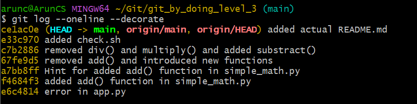

# Level 4 

Task: To understand `git branch` 

>[!IMPORTANT]
>Your task is to complete the tasks "One-by-One" , like first execute 'task_1.py' then 'task_2.py' upto 'task_5.py' then attempt the quiz

| Task | command | Use | 
|------| -------| ----|
| `task_1.py`| `git branch`| *to create new branch*|
| `task_2.py` and `task_3.py`| `git checkout`| *to goto other branches/commits*|
|`task_4.py` | `git log` and `git checkout` | *list commits* and *goto specific branch/commit*|
|`task_5.py` | `git branch -d` | *-d to delete a branch*|


## Git branch


According to [this](https://git-scm.com/book/en/v2/Git-Branching-Branches-in-a-Nutshell) site "Some people refer to Git's branching model as its `killer feature` that includes me also. So there must be something to the banching feature right?.


Yes, infact there are tools other than `git` for managing you versions and codebase but people prefere `git` because of this feature. 

### When do you use `git branch`
There are times when you want to use the `branch` feature of `git`
1. When you diverge from the main workflow and create you own changes , without effecting the main.

>Looks Complicated? lemme explain.
>Imagine your company working on a robotics project , and you are currently using `Arduino` micro-controller, its going fine , and you `main` branch contains all the code needed for the `Arduino` to function. But you have some other idea that you want to use the new famous, low power "ESP8266", What you do?. You can do the following
>- Change the code to support "ESP8266" and keep the code your self.
>- or "create a new branch" and share code with others


>Wait what is the benefit of creating a new branch again? 
>You are in this case "diverging" (taking another route) from the main branch and creating your own "route". In this way you wont effect other routes (main) more technical explenation below.

2. When you want to create and test a new `feature` without effecting main. 


## Scientific.

before talking about git branching , we need to understand how the git stores our data, you have already seen the `git commit` and `git log` featue , to implement that feature , git must store data somewhere right? 

First things to note is that , as i have explained in previous levels , `git` stores data as a series of `snapshots`. "When you make a commit, Git stores a commit object that contains a pointer to the snapshot of the content you staged", in simple terms when you do `git checkout <checkpoint>` <checkpoint> points to some snapshot. 
> Seems complicated? 
> Imagine snapshots as some serires of photos taken by your camera.If the memory card is empty , "Your first photo" will not have any previous photo right? , which is the first commit. And as you take photos the camera names them as "IMAGE_1.png" "IMAGE_2.png" etc right? So note a few things
> - like here the Photo's name is the checkopint and its name is the id and that id points to the photo. 

Almost all the snapshots have `1 parent and child`,(except initial commit). if you check the folowing 

There are 3 commits or snapshots named
1. fadd9798fa81f3d0f2064c2fb400d09262a77ba8
2. 2df82a685bf4c419fba48bb1b865ff1f12625b6d 
3. c34aa961cd4b27c94d46fa590716306c5aed1faa
for making it simple we will use only first 5 or six characters from the snapshot name
1. fadd97 
2. 2df82a
3. 2df82a 
Which is same as above as long as they are unique from each other 
infact you can just do this


```bash
git checkout fadd
```
which is same as 
```bash
git checkout fadd9798fa81f3d0f2064c2fb400d09262a77ba8
```
and this 
```bash
git checkout fadd97
```
 
>[!IMPORTANT]
> If you have commits say `abcdef1` and `abcdef2` 
> ```bash
>git checkout abcdef
>```
>Will not work, because the names are not unique , so you have to use it like this
>```bash
>git checkout abcdef1 
>```

You may have already know when `clone` or `create` a git repocitory , you will be using `main` or `master` branch. For example 


You can see that , there is a text "main" is placed below the "<> Code" which indicates that you are in the "main" branch  

- You check which branch you are on from terminal using the following 


---

In this following image you can seee that there is "HEAD -> main" , which indicates that the "HEAD" is now pointing to "main"? You lost me? lemme explain
Note these points
- HEAD always points to your current checked out commit. or it's a  special pointer that refers to the current commit you have checked out.
- When you do something like `git checkout some_commit` you are moving `HEAD` to that commit . 


If you look at this this is after i run 
```bash
git checkout ce1ac0e
``` 
You can see it says `HEAD` is detached at `ce1ac0e`


The main always contains the same contents of last commit, and checking out the `ce1ac0e` is same , as the main.


Lets consider this following example ,  the figure shows the commits of the previous level.

You can see that the `HEAD` is pointing to `main`(HEAD -> main), with this wee can conclude that 
1. a branch is always points to the latest commit .
2. and imagin `branch` as a named commit.
>[!TIP]
>Technically , you can not name you commit, when you do one , the `git` calculates `sha1sum` of each files and metadata , and branch is just a pointer to the latest commit.


When you do `git checkout` to some branch you are in the `detached HEAD` state. 

### What happen when i create a new branch


- When you are creating a new branch your new branch will poin to the **current commit** (the one HEAD is currently pointing to).
- and when you are checking out a branch the `HEAD` moves to the latest commit of that branch


This is the `log` from main branch You can see that the `HEAD` is now pointing to `main`

This after checking out `new_branch` , you can see that it says `HEAD -> new_branch`

>[!IMPORTANT]
>What ever you do on one branch would not effect the other branches.


>[!IMPORTANT]
> You can create a new branch using 
>```bash
>git branch branch_name
> ```
>or you can do
>```bash
>git switch -c branch-name
>```
> this combines both creating a new branch and checking the branch.

>[!IMPORTANT]
>And if you have done with a branch you can delete it using the following
>```bash
>git branch -d branch-name
>```
> or you can force your deletion
>```bash
>git branch -D branch-name
>```
